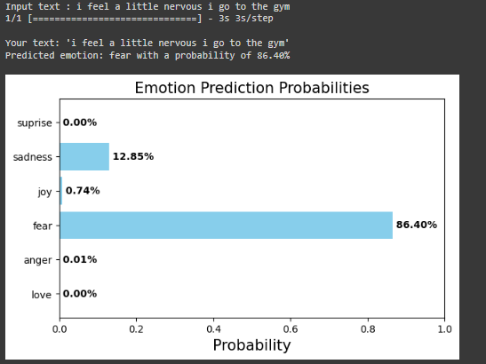

# Emotions-Text-Classification

Proyek ini bertujuan untuk mengklasifikasikan kalimat-kalimat berdasarkan emosinya menggunakan pemrosesan bahasa alami (NLP).

**Jumlah Data Latih:** 16,000 kalimat

**Label Emosi**
- love
- anger
- fear
- joy
- sadness 
- suprise

## Evaluasi Model:

Dalam proses ini, kami menggunakan model klasifikasi dengan Teknik Pemrosesan Teks dan Algoritma Random Forest untuk membuat prediksi emosi dari kalimat yang diberikan. Kami juga melakukan evaluasi performa model menggunakan sejumlah metrik.

**Hasil Prediksi Contoh:**

